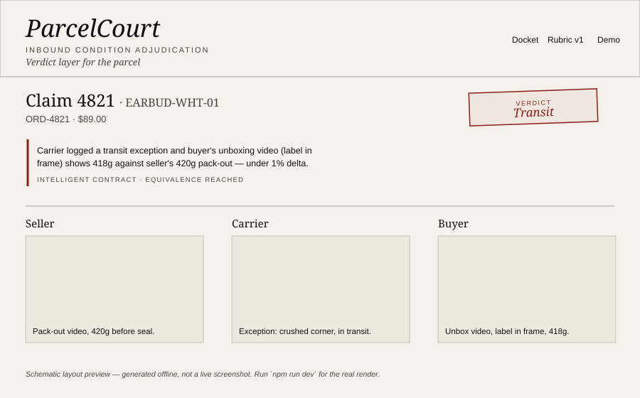

# ParcelCourt

Every marketplace refund flow today runs on the same primitive: a support
agent, reading a JPEG, guessing. ParcelCourt replaces that guess with a
contract. It answers exactly one question — what condition was this parcel
in when it arrived, and who bears that — using evidence submitted on-chain,
tracking and listing facts fetched live and reduced under strict
equivalence, and a locked rubric enforced by a GenLayer Intelligent
Contract across validators. The verdict is not a suggestion an agent can
override; it settles escrow directly.



*(Schematic layout preview generated offline — see [Judge path](#judge-path-90-seconds) to render the real page.)*

## Run in 3 commands

```bash
cd app
npm install && npm run dev
# open http://localhost:3000 — docket, claim 4821, /rubric, /demo all render from fixtures, no chain required
# (mock mode is the default; no env vars needed for this)
```

For live mode against a real GenLayer deployment, see
[Live mode](#live-mode) below.

## What is on-chain vs off-chain

| | On-chain (`contracts/parcel_court.py`) | Off-chain |
|---|---|---|
| Claim & evidence records | Full `claims` / `evidence` TreeMaps, stored as hashes + extracted facts | Raw video/photo bytes (IPFS/S3 — never stored on-chain) |
| Tracking / listing facts | Stable JSON extract, agreed under `gl.eq_principle.strict_eq` | Raw HTML, full API payloads |
| Verdict + rationale | Stored on `claims[id]`, produced under `gl.eq_principle.prompt_non_comparative` | The judge prompt itself is deterministic and versioned (`rubric_id`), but the underlying model call is off-chain non-determinism reduced to on-chain consensus |
| Escrow balances | `balances` TreeMap, mock stable cents | Real settlement rail (USDC, card network) — out of scope, see below |
| Frontend | — | Next.js app reading `list_claims` / `get_claim` / `get_evidence` / `get_rubric` views, mock mode falls back to static fixtures |

No unbounded HTML or images ever land in contract storage — only hashes,
the narrow extracted facts (`status`, `last_scan_city`, `last_scan_date`,
`exception`; `title`, `image_urls`), and the judge's own rationale text
(capped at 800 characters).

## Rubric v1

Full text: [`contracts/rubric.md`](./contracts/rubric.md), also rendered live at `/rubric`.

Five verdicts — `TRANSIT`, `SELLER`, `BUYER`, `SPLIT`, `INSUFFICIENT` — each
mapping deterministically to an escrow split. Evidence is scored as
STRONG or WEAK per party (seller: weight + video; carrier: a live tracking
exception; buyer: label-in-frame unboxing video). An isolated JPEG from
either side is never dispositive alone. Claims under $25 with no strong
evidence default buyer-favorable; everything else with thin evidence on
both sides splits 50/50 rather than guessing.

## Three fixtures

All three share SKU `EARBUD-WHT-01`, $89.00, rendered live at `/demo`:

| # | Scenario | Evidence | Verdict |
|---|---|---|---|
| 01 | Transit damage | Seller 420g pack-out + video; carrier exception; buyer unbox video (label in frame), 418g | `TRANSIT` |
| 02 | Buyer — empty box | Seller 420g pack-out + video; buyer single still, inbound 90g | `BUYER` |
| 03 | Buyer — fabricated | Seller clean 420g pack-out; buyer orphan "perfect crack" still, garbled label text, no video | `BUYER` |

A fourth fixture — both sides post STRONG evidence and the record still
conflicts (matching weights, but the unboxed item doesn't match the
listing) — exercises `SPLIT` in `tests/direct/test_parcel_court.py` but
isn't part of the three-card `/demo` board.

## Architecture

```
payment/order intake  ->  evidence submission (seller/buyer/carrier/warehouse)
        |                          |
        v                          v
   escrow (mock cents)     tracking_url + listing_url
        ^                          |
        |                 gl.nondet.web.render + strict_eq
        |                          |
        |                          v
        |                  compact sorted-key dossier
        |                          |
        |                 gl.eq_principle.prompt_non_comparative
        |                    (locked rubric v1 judge prompt)
        |                          |
        +------ release() <--- verdict + rationale (stored on-chain)
```

See `/protocol` in the app for the same breakdown rendered as a page.

## What we did not build

- **Wardrobing / return-fraud beyond inbound condition.** ParcelCourt does
  not adjudicate "I don't like it," sizing, or buyer's-remorse returns —
  only condition on arrival.
- **A Temu/marketplace API integration.** `tracking_url` and `listing_url`
  are generic — no vendor-specific scraping or partnership plumbing.
- **Real USDC or any live settlement rail.** `balances` is mock stable
  cents on testnet; wiring a real payout rail is a follow-on, not a demo
  requirement.
- **A reputation system, a chatbot, or a token.** One court, one rubric,
  one verdict per claim.

## Judge path (90 seconds)

1. Open the docket (`/`) — three settled claims, one per fixture.
2. Click **Claim 4821** — three evidence columns (Seller / Carrier /
   Buyer), the oxblood `TRANSIT` verdict chip, and the two-line rationale
   under "Intelligent Contract · equivalence reached."
3. Open `/rubric` — the real `PARTY | STRONG | WEAK` table, rendered from
   the deployed contract's `get_rubric()` (or fixtures, in mock mode).
4. Open `/demo` — all three fixtures side by side: `TRANSIT`, `BUYER`,
   `BUYER`, same SKU, three different inbound conditions.
5. Optional: `/protocol` for the on-chain/off-chain stack diagram.

## Live mode

```bash
cd app   # deploy/seed/dev all resolve genlayer-js from app/node_modules — run from here

# 1. Deploy (requires a GenLayer Studio instance or testnet + funded key)
GENLAYER_CHAIN=studionet GENLAYER_DEPLOYER_KEY=... npm run deploy

# 2. Seed the three fixtures against the deployed address
GENLAYER_CHAIN=studionet GENLAYER_CONTRACT_ADDRESS=... GENLAYER_DEPLOYER_KEY=... npm run seed

# 3. Run the app against the live contract
NEXT_PUBLIC_MOCK=0 GENLAYER_CHAIN=studionet GENLAYER_CONTRACT_ADDRESS=... npm run dev
```

`GENLAYER_CHAIN` is one of the named chains `genlayer-js` exports from
`genlayer-js/chains`: `localnet`, `studionet`, `testnetAsimov`, or
`testnetBradbury`.

If a GenLayer Studio wallet provider is injected in the browser, the
**Run adjudication** button on a claim page uses it directly; otherwise set
`GENLAYER_DEMO_ACCOUNT` for a headless demo signer. The UI never blocks
behind a broken wallet modal — a missing wallet surfaces as a clear inline
error, not a stuck spinner.

## Tests

```bash
# Direct-mode unit tests (mocked web/LLM, runs anywhere — no network needed)
pip install pytest
pytest tests/direct -v   # uses the offline stub below unless genlayer-test is installed

# Integration test against a live Studio/testnet deployment
pip install genlayer-test
gltest tests/integration -v -s
```

**Do not `pip install genlayer`** — that resolves to PyPI's `genlayer==0.0.1`,
an empty placeholder GenLayer Labs uploaded once to reserve the name (see
https://pypi.org/project/genlayer/); it has no `gl`, no `Contract`, nothing,
and installing it will not make `tests/direct` pass. The real,
actively-maintained package for local contract testing is
[`genlayer-test`](https://pypi.org/project/genlayer-test/), which ships an
actual "Direct Mode" (in-memory, no Docker, `direct_vm` / `direct_deploy`
pytest fixtures, `mock_web` / `mock_llm` cheatcodes, `expect_revert`) — this
is the real equivalent of the offline stub below. `tests/direct` here is
written against a hand-rolled `gl` surface rather than `genlayer-test`'s
`direct_vm`/`direct_deploy` fixtures, so treat it as a stand-in to verify the
contract's logic without a working GenVM, not as a substitute for adapting
to `genlayer-test`'s real Direct Mode API before shipping.

`tests/direct` covers the open → submit → adjudicate happy path, a
double-adjudicate revert, an unknown-role revert, a missing-claim revert,
the exact dossier contents fed to the judge for fixtures 01–03 (carrier
exception + 420g; 90g vs 420g; buyer evidence marked `weak`), a fourth
both-strong-conflict fixture asserting `SPLIT`, and JSON-verdict-schema
enforcement (a malformed judge response reverts rather than silently
settling).

**A note on the offline test stub:** this repo was built in a sandboxed
environment without outbound network access, so no real package — neither
`genlayer-test` nor plain `pytest` — could be installed to execute the
suite directly here. `tests/direct/_stub/genlayer/` is a minimal,
clearly-labeled stand-in for the documented API surface (`gl.contract.Contract`,
`gl.storage.TreeMap`/`DynArray`, `gl.public.*`, `gl.message`, `gl.vm.UserError`,
`gl.nondet.web.render`, `gl.nondet.exec_prompt`, `gl.eq_principle.strict_eq` /
`prompt_non_comparative`, plus `genlayer.types.Address`/`u256`) — matched
against two contracts confirmed live on GenLayer Studio, not a GenLayer
simulator and not `genlayer-test`'s real Direct Mode. `conftest.py` only
activates the stub when a real, usable `genlayer` isn't importable (it
specifically checks for `genlayer.contract.Contract`, not just "is some
package named `genlayer` on the path" — the empty `genlayer==0.0.1`
placeholder would otherwise slip through that check). The contract logic
itself was hand-verified end-to-end against this stub (all four fixture
verdicts, escrow splits, and reverts) before shipping; running
`pytest tests/direct -v` yourself, and ideally adapting the suite to
`genlayer-test`'s real `direct_vm`/`direct_deploy` fixtures, is the way to
confirm it against the actual SDK.

## Known limitations

- The offline test stub above stands in for `genlayer-test`'s real Direct
  Mode — verify against the real package before treating this as
  production-audited.
- `npm install` / `next build` were not run in this sandbox (no network to
  resolve the pinned versions in `package.json`) — the app code is written
  and internally consistent, but hasn't been build-verified end-to-end.
  Run `npm run build` yourself to confirm.
- **Storage value types are not fully confirmed.** `claims`/`evidence`
  currently store plain Python `dict` values inside
  `gl.storage.TreeMap`/`DynArray`. The two contracts this was checked
  against only ever store primitives (`u256`, `Address`) as TreeMap values,
  and independent evidence (the `genvm-linter` project's documented rule
  set) suggests GenVM's real pattern for structured per-record storage is
  an `@allow_storage @dataclass`-decorated class, not a raw `dict`. If
  Studio still reports a schema-load error after the fixes in this
  version, this is the next thing to convert — ask and it can be done as a
  follow-up, since the exact import path for `allow_storage` under this
  repo's `import genlayer as gl` style isn't confirmed yet either.
- The README screenshot above is a schematic SVG, not a captured
  screenshot, for the same reason — regenerate it from `npm run dev` once
  installed.
- `gltest tests/integration` requires an actual Studio/testnet deployment
  and was not run here.
- Escrow uses mock stable cents, not a real settlement rail (see "What we
  did not build").

## License

MIT — see [LICENSE](./LICENSE).
